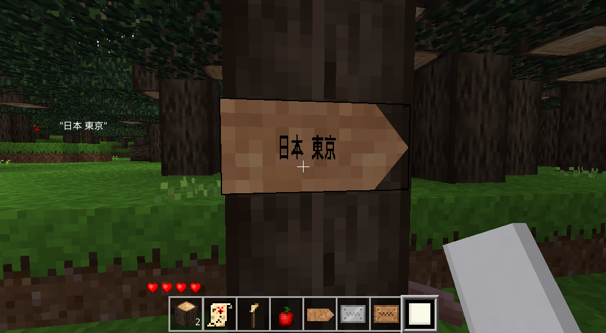
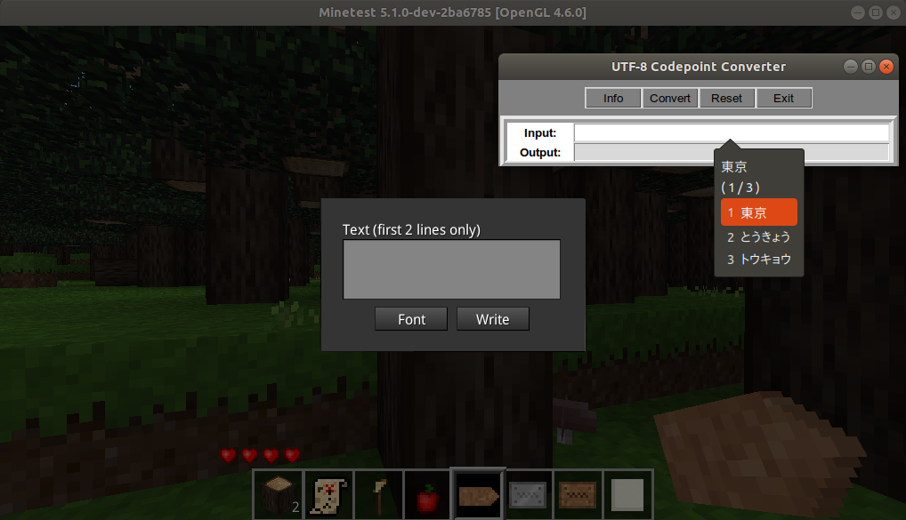
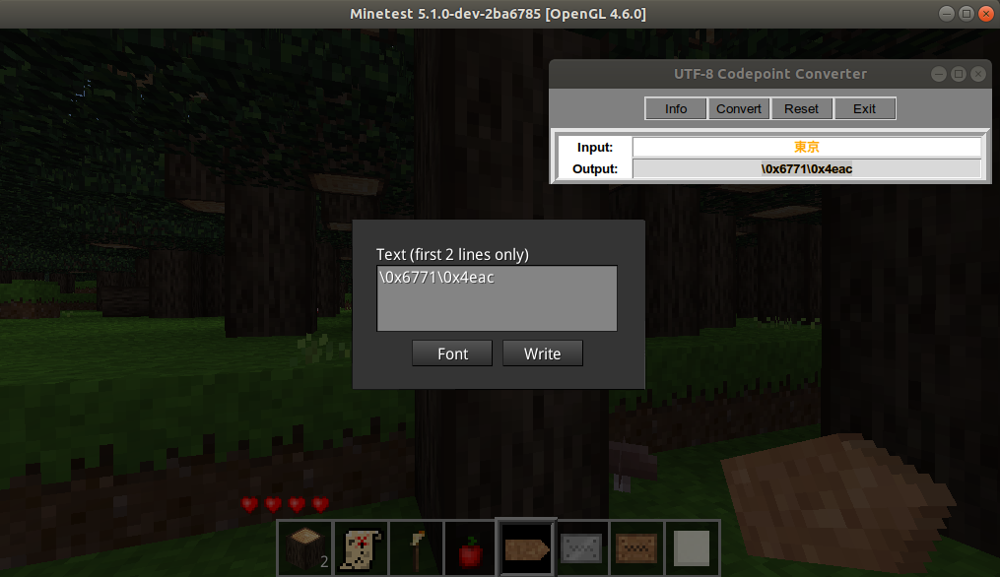
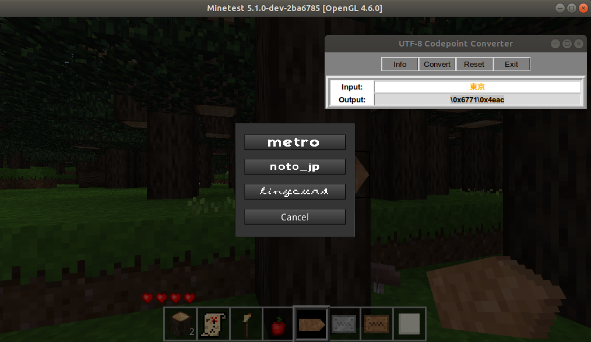

# Textures to display Japanese characters, using Google's Noto font

This mod adds characters texture to allow the Font API mod (from [display_modpack](https://github.com/pyrollo/display_modpack)) to display Japanese characters.

This mod includes hiragana, katakana and an amount of kanjis that is probably complete but excessive.It also includes uppercase and lowercase latin letters.

Be warned that it weights 21 MB uncompressed. In future versions I shall restrict the amount of ideograms to the most commonly used (there are currently the 20 000 kanjis defined by the unicode standard, but far less are in common use.)

**Dependencies**: font_api

**License**: code under LGPL v3.0, font under CC-BY-SA 3.0

## Original Font

**Original font**: [Google Noto font](https://www.google.com/get/noto/), more specifically, Noto Sans CJK-Regular

**License**: [SIL Open Font License, Version 1.1](http://scripts.sil.org/cms/scripts/page.php?site_id=nrsi&id=OFL)

**How to use**

In order to actually write on the signs, we need to get around irrlicht's limited support of international inputs. 

First, we need a version of display_modpack that will parse strings that include "\uXXXX" encoded characters: https://github.com/yquemener/display_modpack

Then, we need to use a tool to generate these strings. I use muhdnurhidayat (MNH48.com)'s tool from the [Unicode Parser CSM](https://github.com/MuhdNurHidayat/unicodeparser). It is included in tools/. There is [python 2 version](tools/UnicodeConverter.pyw) and a [python 3 version](tools/UnicodeConverter3.pyw).

Start UnicodeConverter along with minetest and type the text you want to put on the sign using your regular IME:

Then copy the Output string generated by UnicodeConverter

Make sure you select the noto_jp font in order to display the characters correctly:

